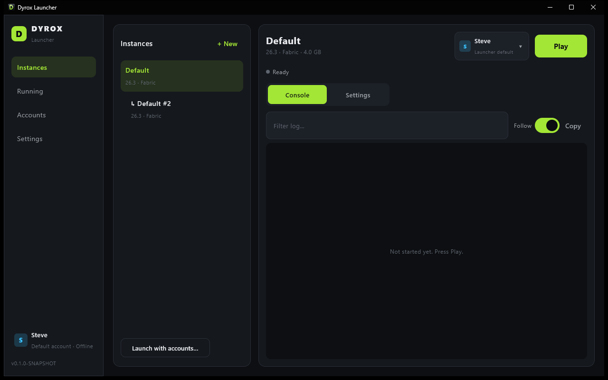
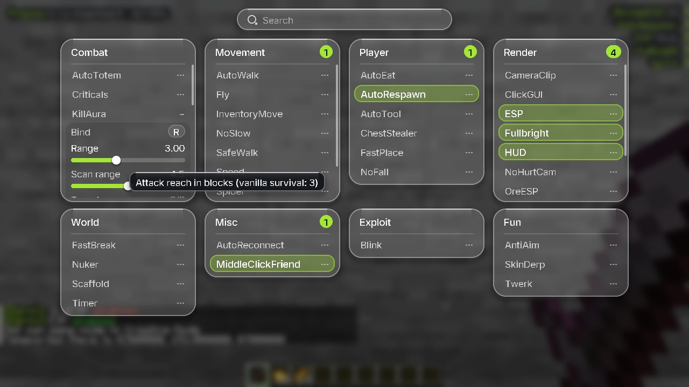
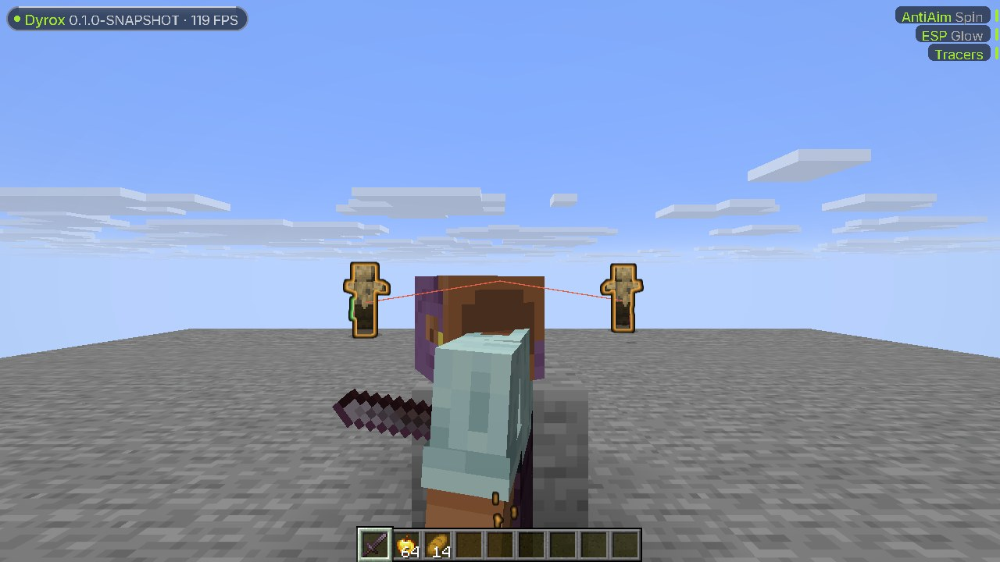
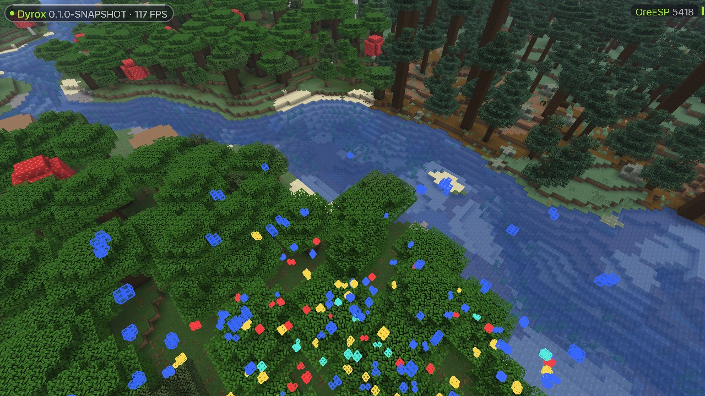

<p align="center"></p>

# Dyrox

A Minecraft Java Edition launcher (**Dyrox Launcher**) with a built-in Fabric utility client
(**Dyrox Client**) for Minecraft **26.3**. Windows 11 first, Linux second.

- **Launcher:** installs any version (vanilla or Fabric), the right Java, and runs several games side by
  side, each with its own account
- **Accounts:** Microsoft sign-in (official OAuth), offline profiles, encrypted on disk, switchable in-game
- **Client:** 40 modules, a "Liquid Glass" ClickGUI, HUD, silent rotations, and a spinbot with a smooth
  third-person camera

| | |
|---|---|
|  |  |
|  |  |

## Install

Download the installer from the [Releases](../../releases) page:

- **Windows:** `Dyrox Launcher-<version>.msi` (Start menu and desktop shortcuts, upgrades in place)
- **Linux:** `dyrox-launcher_<version>_amd64.deb` (install with `sudo apt install ./dyrox-launcher_*.deb`)

Both bundle their own Java runtime. The launcher downloads Minecraft, Fabric and the Java version each
game needs on first launch (about 600 MB for 26.3).

## Quick start

1. **Accounts** → *Add offline account* (singleplayer and offline-mode servers) or *Sign in with Microsoft*
   (needs an Azure app ID, see [below](#microsoft-accounts)).
2. **Instances** → *New*: pick 26.3 and Fabric. The Dyrox Client, Fabric API and Fabric Language
   Kotlin are installed automatically.
3. **Play**. In game, **Right Shift** opens the ClickGUI; chat commands start with `.`
   (`.help`, `.t killaura`, `.bind fly f`, `.set killaura range 3.5`, `.friend add Notch`).

To play several accounts at once, use *Launch with accounts…* or give each instance its own account.

## Features

### Launcher

- Every version from Mojang's manifest (releases, snapshots on request), cached for offline use
- Vanilla or **Fabric** (loader, Fabric API) installed automatically; the Dyrox Client for 26.3
- Parallel, SHA-1-verified, atomic downloads of the client jar, libraries, natives and assets
- The right Java runtime per version from Mojang (Java 25 for 26.3, Java 8 for 1.8.9, ...)
- Correct launch commands for modern and legacy versions; access tokens redacted everywhere
- Live, colour-coded console per game (parses Minecraft's log4j XML output), filter and copy
- Per-instance RAM, JVM arguments, window size, Java, game folder, config profile and optional
  isolated storage

### Accounts

- **Microsoft:** official OAuth (browser with PKCE, or device code) → Xbox Live → XSTS → Minecraft
  services, with automatic token refresh
- **Offline profiles** (username only, clearly labelled) with vanilla-compatible offline UUIDs
- **Encrypted on disk:** AES-256-GCM, with the key protected by Windows DPAPI or the Linux keyring.
  No plaintext tokens, ever
- Skin heads, type, last used, token-validity indicator; add, remove, select, rename; import and
  export (tokens are never exported)
- **In-game alt manager** on the multiplayer screen: switch accounts without restarting

### Multi-instance

- Run two or more games at once, each with its own account, folder, profile, RAM and process
- Live status (starting, running, crashed), PID, memory, uptime and a separate log for each game;
  stop gracefully or kill
- **Launch with selected accounts:** one instance per chosen account in one click
- Conflict-safe: game folders are locked while in use, an account can't be in two games, window
  titles show instance and account, and each game gets its own IPC port

### Dyrox Client

- Kotlin module system with an event bus, typed settings (boolean, slider, range, choice, multi-choice,
  colour, text, keybind, modes) and JSON config profiles
- **Liquid Glass ClickGUI:** frosted panels, capsule controls, Inter typeface, search, drag and drop,
  scrolling, tooltips, animations
- **HUD:** watermark, animated array list, toast notifications
- **40 modules** in Combat, Movement, Player, Render, World, Exploit, Misc and Fun: KillAura (silent,
  speed-limited rotations), TriggerBot, Criticals, Velocity, AutoTotem, Fly, Speed, Step, NoSlow,
  SafeWalk, Scaffold, Nuker, FastBreak, NoFall, AutoTool, ChestStealer, AutoEat, ESP, Tracers,
  StorageESP, OreESP, Fullbright, Zoom, Blink, Timer, AntiAim/spinbot with a smooth third-person camera,
  and more. Full list: [docs/CLIENT.md](docs/CLIENT.md#modules-phase-7)
- Chat commands: `.toggle`, `.bind`, `.binds`, `.set`, `.config`, `.friend`, `.modules`, `.prefix`, `.help`

## Microsoft accounts

Microsoft sign-in needs an Azure app ID that Mojang has approved for the Minecraft API. Dyrox doesn't
ship one: enter yours in **Settings** (or set `DYROX_MS_CLIENT_ID`). Until then, offline accounts work
for singleplayer and offline-mode servers. See [docs/AUTH.md](docs/AUTH.md#azure-app-id-required-for-microsoft-accounts).

## Build from source

Needs **JDK 25** (Temurin recommended); Gradle comes with the wrapper.

```bash
./gradlew build                     # compile everything and run all tests
./gradlew :launcher:run             # start the launcher from source
./gradlew :launcher:packageMsi      # Windows installer   → launcher/build/compose/binaries/main/msi/
./gradlew :launcher:packageDeb      # Linux package (on Linux) → .../main/deb/
./gradlew :client:build             # just the mod        → client/build/libs/dyrox-client-*.jar
```

Builds are reproducible: the same sources produce byte-identical jars.

Headless dev CLI (no UI), useful for testing the launcher core:

```bash
./gradlew :launcher:runCli --args="versions"
./gradlew :launcher:runCli --args="accounts add-offline Steve"
./gradlew :launcher:runCli --args="instances launch default --accounts Steve,Alex"
./gradlew :launcher:runCli --args="launch 1.8.9 --dry-run"
```

Data lives in `%APPDATA%\DyroxLauncher` (Windows) or `~/.local/share/dyrox-launcher` (Linux). Set
`DYROX_HOME` to use another folder, e.g. a throwaway one for development.

## Releasing

CI ([build.yml](.github/workflows/build.yml)) builds and tests every push on Windows and Linux and
uploads the mod jar. Pushing a tag `vX.Y.Z` runs [release.yml](.github/workflows/release.yml): it
builds the MSI, the DEB and the mod jar with that version and publishes them, with SHA-256 checksums,
as a GitHub release.

## Project layout

| Path | What |
|---|---|
| `shared/` | Used by launcher and client: HTTP, auth, encrypted vault, accounts, IPC, platform, palette |
| `launcher/` | Compose Desktop launcher: core (manifest, downloads, Java, Fabric, launch, instances) and UI |
| `client/` | Dyrox Client, the Fabric mod (Kotlin; mixins in Java) |
| `docs/` | [Architecture](docs/ARCHITECTURE.md), [auth](docs/AUTH.md), [multi-instance](docs/MULTI_INSTANCE.md), [client](docs/CLIENT.md), [mixins](docs/MIXINS.md) |

## License

GPL-3.0-or-later. See [LICENSE](LICENSE) and [CREDITS.md](CREDITS.md).

Not an official Minecraft product. Not approved by or associated with Mojang or Microsoft. Some client
modules (Fly, Speed, KillAura, ...) break the rules of many multiplayer servers; use them where they are
allowed.
